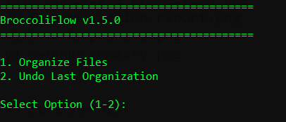
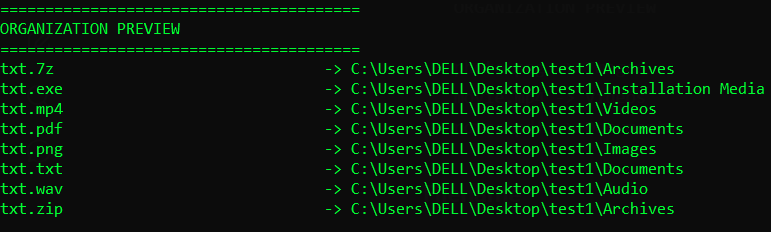
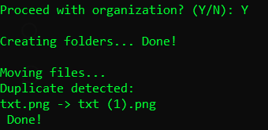
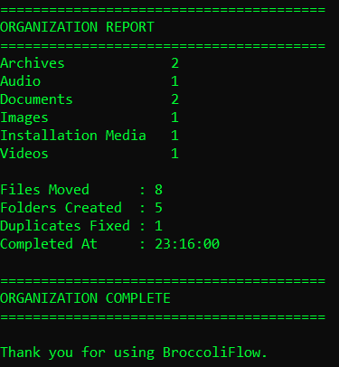
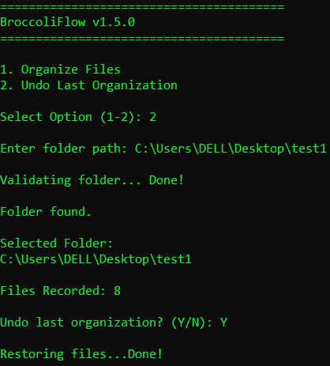
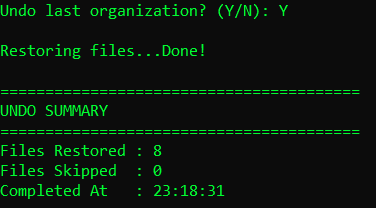

# 🥦 BroccoliFlow

A lightweight Python utility that scans folders, analyzes files, and generates organization reports.

## Features
### Undo System
BroccoliFlow stores an operation log and can restore files to their original locations after organization.

- Validate folder paths before processing
- Scan and analyze folder contents
- Detect and categorize file types
- Automatically organize files into category folders
- Sort files into Images, Documents, Videos, Audio, Archives, Installation Media, and Misc categories
- Generate organization previews before making changes
- Display detailed scan and organization reports
- Create only the folders that are needed
- Preserve existing subfolders without modifying their contents
- Automatic duplicate filename handling
- Collision-free file organization
- Can undo previous organizations without conflicts

## Current Status

Version: v1.7.0

Currently supports:

- Folder validation
- Folder scanning
- File type analysis
- Automatic file organization
- Category based file sorting
- Organization preview system
- Detailed scan reports
- Smart folder creation
- Automatic duplicate file handling
- Can undo past organizations
- Handles upto 2000 files gracefully under ~15 seconds
- Rollback features

## Screenshots

### Main Menu



### Organization Preview



### Duplicate Protection



### Organization Report



### Undo System




## Roadmap

### v1.0.0 ✅
- Folder validation

### v1.1.0 ✅
- Folder scanning
- File analysis

### v1.2.0 ✅
- File categorization preview

### v1.3.0 ✅
- Automatic file organization
- Category folder creation

### v1.4.0 ✅
- Duplicate file protection
- Collision handling

### v1.5.0 ✅
- Undo last organization

### v1.6.0 ✅
- Major improvments

### v2.0.0
- GUI version

## Installation

```bash
git clone https://github.com/Mr-Broccoli/BroccoliFlow.git
cd BroccoliFlow
python main.py
```

## 📚 Project Files

- [CHANGELOG](./CHANGELOG.md)
- [LICENSE](./LICENSE)

## Tech Stack

- Python
- pathlib
- shutil

## Author

Nemo (Mr-Broccoli)