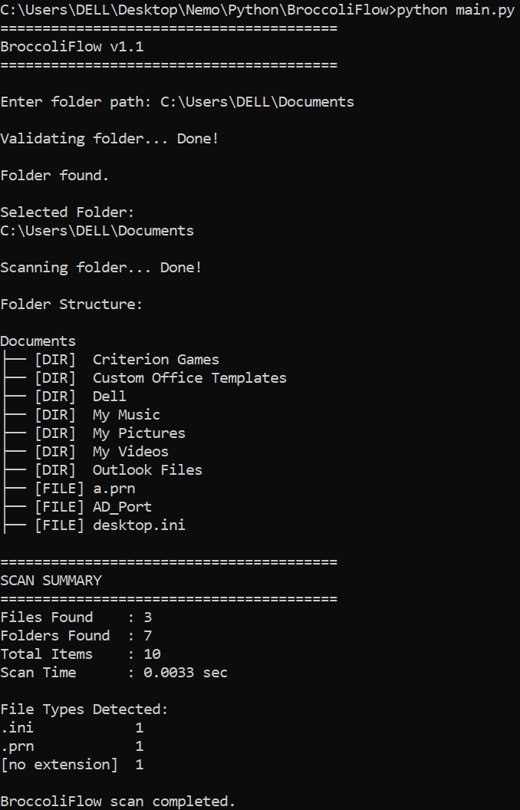
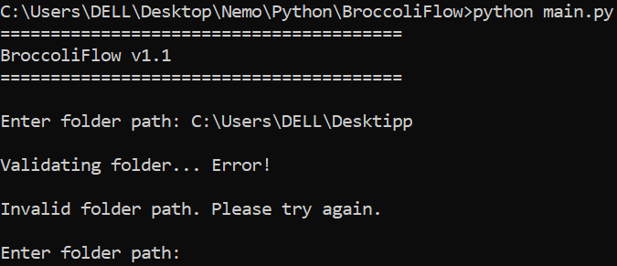

# 🥦 BroccoliFlow

A lightweight Python automation tool that organizes files into categorized folders.

## Features

- Validate folder paths
- Scan folder contents
- Display folder structure
- Count files and folders
- Detect file types
- Generate scan reports
- Handle invalid paths gracefully

## Current Status

Version: v1.1

Currently supports:

- Folder existence validation
- Folder count and analysis
- Fodler summary

## Screenshots

<p align="center">
  
  
  
</p>

## Roadmap

### v1.2
- Automatic folder creation

### v1.3
- File movement

### v1.4
- Duplicate detection

## Installation

```bash
git clone https://github.com/Mr-Broccoli/BroccoliFlow.git
cd BroccoliFlow
python main.py
```

## 📚 Project Files

- [CHANGELOG](./CHANGELOG.md)
- [LICENSE](./LICENSE)

## Tech Stack

- Python
- pathlib

## Author

Nemo (Mr-Broccoli)
