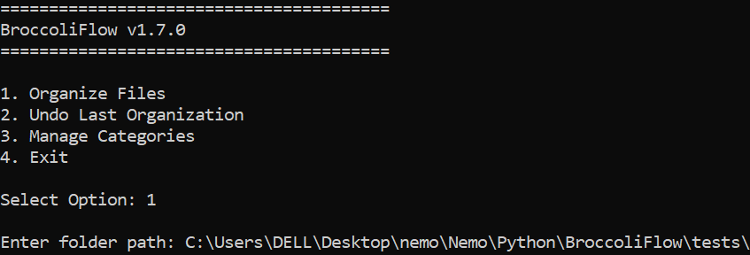
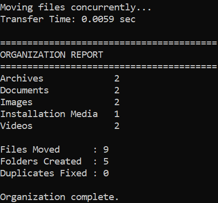
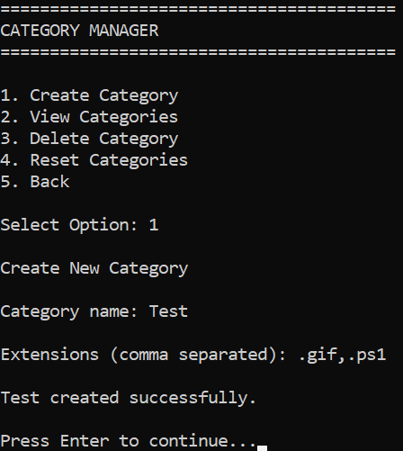
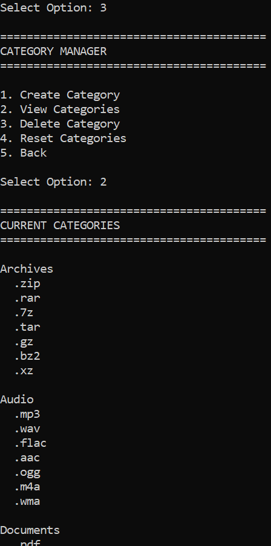
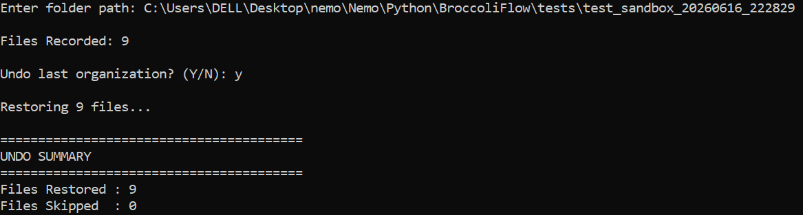

# 🥦 BroccoliFlow

A professional-grade, high-performance file management utility that scans directories, organizes files into categorical folders, and provides atomic rollback capabilities.


## Features

### Advanced Organization & Performance

* **Concurrent Execution**: Utilizes `ThreadPoolExecutor` for high-speed file processing.

* **Intelligent Categorization**: Sorts files into Images, Documents, Videos, Audio, Archives, Installation Media, and Misc categories based on customizable rules.

* **Duplicate Protection**: Automatically detects filename collisions and resolves them with sequential renaming.


### Safety & Recovery

* **Undo System**: Records every file move in a persistent JSON operation log, allowing for full restoration to original locations.

* **Atomic Rollback**: Automatically triggers an emergency restoration if an organization process is interrupted or fails.

* **Dry-Run Mode**: Allows users to preview all proposed file movements without making any changes to the disk.


### Command-Line Interface

* **CLI Controller**: Fully refactored for terminal-based automation using `argparse`.

* **Direct Flags**: Supports streamlined workflows via `--source`, `--organize`, `--undo`, and `--dry-run`.

* **Robust Exits**: Implements safe `KeyboardInterrupt` handling for stable terminal sessions.


## Current Status

Version: v1.7.0

* Folder validation & scanning

* Multi-threaded file organization

* Category-based sorting with custom configuration

* Operation logging & atomic rollback

* "Undo" restoration system

* CLI automation with dry-run support

* Performance-optimized (handles thousands of files efficiently)


## Screenshots

<p align="center">
  
  
</p>

<p align="center">
  
  
</p>

<p align="center">
  
</p>


## Roadmap

### v1.0.0 - v1.6.0 ✅

* Core engine, concurrency, and undo system implemented.

### v1.7.0 ✅

* CLI architecture and dry-run functionality implemented.

### v1.8.0

* Advanced logging system.

### v1.9.0

* Configuration schema validation.

### v2.0.0

* Graphical User Interface (GUI) development.

## Installation

```bash
git clone https://github.com/Mr-Broccoli/BroccoliFlow.git
cd BroccoliFlow
python main.py --source "path/to/directory" --organize

```

## 📚 Project Files

* [CHANGELOG](./CHANGELOG.md)
* [LICENSE](./LICENSE)

## Tech Stack

* Python
* pathlib
* shutil
* ThreadPoolExecutor
* argparse

## Author

Nemo (Mr-Broccoli)