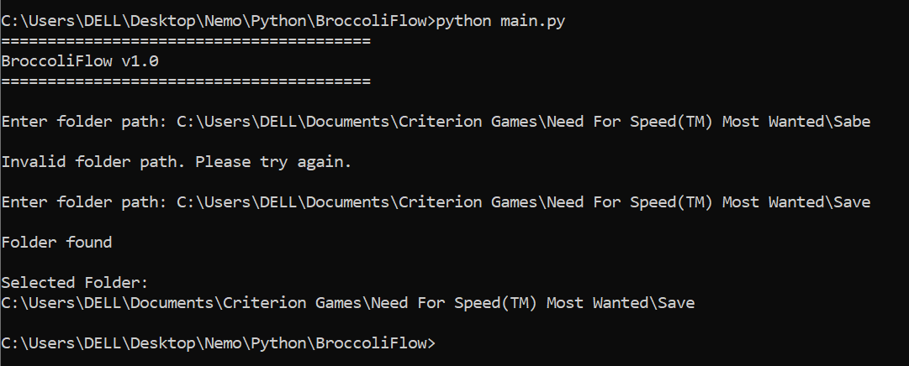

# 🥦 BroccoliFlow

A lightweight Python automation tool that organizes files into categorized folders.

## Features

- Folder path validation
- Automatic file organization (planned)
- Duplicate file detection (planned)
- Organization reports (planned)

## Current Status

Version: v1.0

Currently supports:

- Folder existence validation

## Screenshots



## Roadmap

### v1.1
- Scan folder contents

### v1.2
- File type detection

### v1.3
- Automatic folder creation

### v1.4
- File movement

### v1.5
- Duplicate detection

## Installation

```bash
git clone https://github.com/Mr-Broccoli/BroccoliFlow.git
cd BroccoliFlow
python main.py
```

## Tech Stack

- Python
- pathlib

## Author

Nemo (Mr-Broccoli)